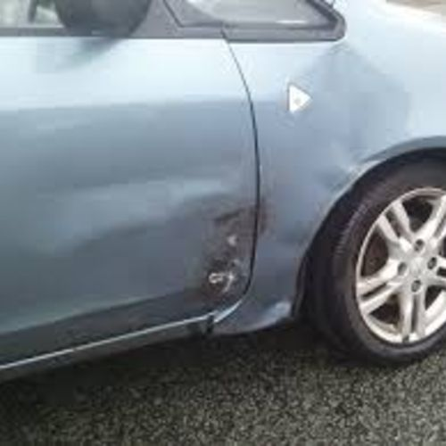
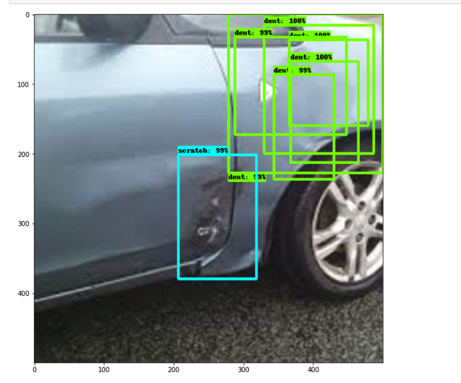
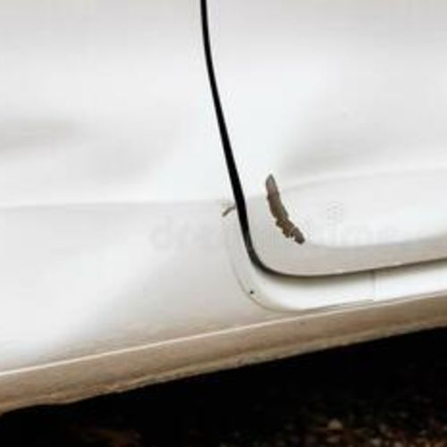
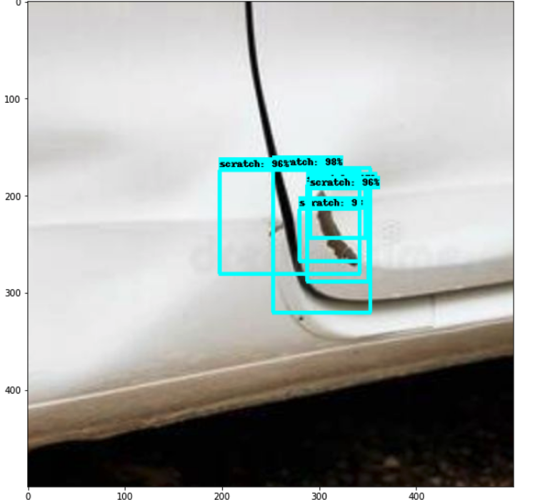

## Car Damage Detection using Sagemaker and tensorflow

### Usecase: 
Global vehicle insurance & vehicle rental industries still rely on manual ways to detect the vehicle damage & its intensity. Visual quality inspection is commonly used for detecting the damage for claim process. The industry is steeped with manual processes, paper-driven operations, high premium offerings, poor customer service, long turnaround time, etc. 
Here we will use machine learning - object detection “Efficientdet” model with sagemaker and tensor flow. Object detection model will be used to identify & mark the dent and scratch area in the car images.

Let’s refresh the basic terms used in building this ML Model.

### What is Machine Learning (ML)?
Machine learning is a method of data analysis that automates analytical model building. It is a branch of artificial intelligence based on the idea that systems can learn from data, identify patterns and make decisions with minimal human intervention.

### What is Object Detection?
Object detection is a computer technology related to computer vision and image processing that deals with detecting instances of semantic objects of a certain class (such as humans, buildings, or cars) in digital images and videos.

### What is Efficentdent Model?
EfficientDet is an object detection machine learning model, which utilizes several optimization and backbone tweaks, such as the use of a BiFPN, and a compound scaling method that uniformly scales the resolution, depth and width for all backbones, feature networks and box/class prediction networks at the same time.
 
### What is a loss function or classification loss in your training?
Loss functions is a crucial factor that affecting the detection precision in object detection task. This loss will help with any task which requires classification. We are given k categories and our job is to make sure our model is good job in classifying x number of examples in k categories. Let’s take example of this project where we are given 100 images of 2 categories and our task is to classify each given image into either of these categories “dent” and/or “scratch”.

### Overview
In this repository, we will build a custom model using Sagemaker & tensorflow to provide bounding boxes on car images consisting of “dents” and/or “Scratch”.
Firstly, use Amazon SageMaker Ground Truth to label the car images with bounding box using private workforce option. After finishing the labelling job, ground truth will create & save a manifest file in S3.

Next steps, use Amazon SageMaker to build, train, and deploy an EfficientDet model using the TensorFlow Object Detection API. It is built on top of TensorFlow 2 that makes it easy to construct, train and deploy object detection models. It also provides the TensorFlow 2 Detection Model Zoo which is a collection of pre-trained detection models we can use to accelerate our Model building.

### High Level Steps:-
•	Label the car images with bounding boxes as “dent” and/or “scratch” using Sagemaker Ground Truth
•	Generate the dataset TFRecords and label map using SageMaker Processing job
•	Fine-tune an EfficientDet model with TF2 on Amazon SageMaker
•	Monitor your model training with Tensorboard and SageMaker Debugger
•	Deploy your model on a SageMaker Endpoint and visualize predictions

### Get started - Instructions
Follow the step-by-step guide by executing the notebooks in the following folders:
•	0_ground_truth/ ground_truth.ipynb
•	1_prepare_data/prepare_data.ipynb
•	2_train_model/train_model.ipynb
•	3_predict/deploy_endpoint.ipynb

|||
| -------------- | ---------------------------- |
|||
|||

## License
This library is licensed under the MIT-0 License. See the LICENSE file.

